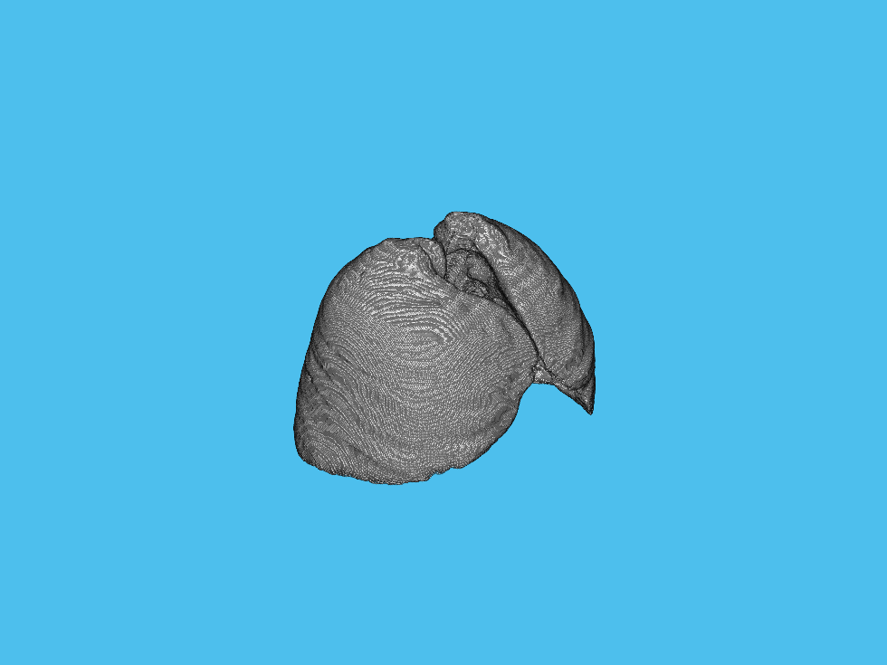

# 指纹增强、CT图像分割、图像空间风格变换

数字图像处理 课程项目 (2021秋)，清华大学自动化系

任课教师: [冯建江](https://scholar.google.com/citations?user=qlcjuzcAAAAJ&hl=en-US)

## [项目1 指纹增强](./fingerprint/)

|                         Input                         |                             Output                              |
| :---------------------------------------------------: | :-------------------------------------------------------------: |
|  |  |

## [项目2 CT图像分割](./CT/)
需要[下载CT数据](https://cloud.tsinghua.edu.cn/f/be56cf5fb9e24bee8f20/)

|                  Lung Seg Result                   |                  Trachea Seg Result                   |
| :------------------------------------------------: | :---------------------------------------------------: |
|     |     |
|                    Lung Seg GT                     |                    Trachea Seg GT                     |
|  |  |

## [项目3 图像空间风格变换](./shifting/)
|                            Input 1                             |                           Input 2                           |                     Input Target                      |
| :------------------------------------------------------------: | :---------------------------------------------------------: | :---------------------------------------------------: |
|  |  |  |
|                            Output 1                            |                          Output 2                           |                                                       |
|  |  |                                                       |
